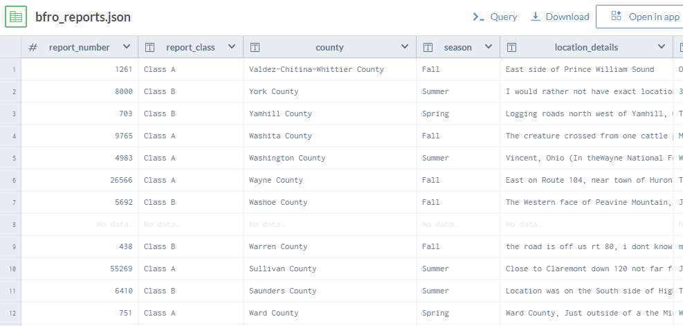
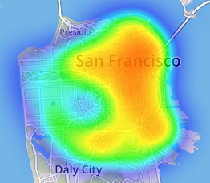
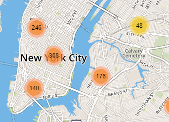
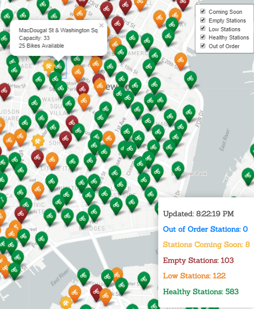

Project 2 – Team Name D3 – Andrew Haug, Mark Rudolph & Sean Roth

Topic Description:  Our group has decided to create a map to help track down the untraceable beast known as BigFoot. Although there have been many tv shows and specials to find Big Foot many of these programs are based off speculation rather than facts. Therefore, we were forced to assemble a team of data scientists to develop the tools needed to finally catch the mythical beast.  In our project we will analyze the following: 

•	Geographic locations of most reported sightings

•	Time of year of most occurrences 

•	Recommendation on where we will capture Big Foot!

Database Source:   https://data.world/timothyrenner/bfro-sightings-data 
 
Inspiration Screenshots:

Sketch of final presentation: 

 
Github Repository Link: 
